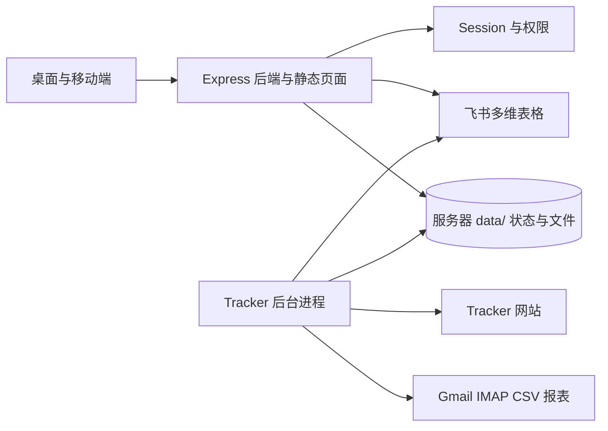

# 车辆调度系统项目维护与交接手册

更新日期：2026-09-24

本手册说明车辆调度系统的组成、生产运行方式、数据同步流程和常见排查步骤。它面向后续接手开发、运维和飞书多维表格配置的人员。仓库不保存生产密码、访问令牌、OAuth 密钥或 `.env` 内容。

## 1. 系统概览

系统由桌面车辆总览、移动调度页面、Node.js/TypeScript 后端和 Tracker 后台进程组成。后端通过飞书/Lark API 读取和更新多维表格；Tracker 进程读取 Tracker 车辆状态，并可从 Gmail 收取 `Trip Report (Detail)` CSV 报表，解析后按车辆匹配结果更新车辆档案里程。



## 2. 代码目录

| 路径 | 用途 |
| --- | --- |
| `src/server.ts` | Express API、登录与权限中间件、车辆/调度接口、服务启动 |
| `src/lark.ts` | 多维表格、车辆档案、附件及飞书 API 封装 |
| `src/auth.ts` | 本地账号、角色权限和服务端 Session |
| `src/scheduler.ts` | 调度表轮询与任务状态处理 |
| `src/tracker-sync.ts` | Tracker 状态采集、Gmail 报表检查、里程同步定时任务 |
| `src/tracker-email-report.ts` | 邮件附件读取、CSV 报表文件和读取状态 |
| `src/tracker-csv-report.ts` | CSV 字段解析、车牌/车辆编号归一化及报表统计 |
| `src/tracker-mileage-sync.ts` | 报表与车辆匹配、里程写回、审计及重试逻辑 |
| `web/` | 桌面与移动端页面、登录页、车辆详情和编辑界面 |
| `data/` | 生产运行状态、账号 Session、同步审计、附件缓存和浏览器配置；已由 Git 忽略 |
| `test/` | Node.js 测试，目前包含 Tracker 里程重试测试 |

## 3. 生产运行信息

- 生产主机：Windows 主机 `serversmall`。
- 应用目录：`C:\Applications\lark-dispatch-backend`。
- PM2 Web 服务：`lark-dispatch`，当前生产端口为 3100；端口以服务器 `.env` 的 `PORT` 为准。
- PM2 Tracker 工作进程：`lark-tracker-sync`。Tracker 采集/邮件同步需要此进程单独运行。
- HTTPS 入口由服务器上的反向代理提供。不要直接公开应用端口，也不要把内部网络地址或登录凭据写入本仓库。
- 截至本手册更新时，Web 服务和 Tracker 工作进程均在线；服务器端 Session 默认有效期上限为 12 小时，正常结束浏览器会话后需重新登录。

在服务器 PowerShell 中查看状态：

```powershell
pm2.cmd status
pm2.cmd logs lark-dispatch --lines 100
pm2.cmd logs lark-tracker-sync --lines 100
```

重启时只重启本次改动涉及的进程，避免影响同机上的其他应用：

```powershell
pm2.cmd restart lark-dispatch --update-env
pm2.cmd restart lark-tracker-sync --update-env
```

## 4. 构建、验证和部署

在开发机仓库根目录执行：

```powershell
npm install
npm run build
node --check web/app.js
node --test test/tracker-mileage-sync.test.mjs
git diff --check
```

生产目录不是 Git 工作树。发布时先构建并验证，再备份将覆盖的文件，然后复制产物到生产目录。后端变更至少同步 `src/` 对应源文件和 `dist/` 对应 JavaScript 产物；页面变更同步对应的 `web/` 文件。完成复制后，仅重启对应 PM2 进程，并确认服务状态和健康接口。

建议发布顺序：

1. 确认工作区只包含本次发布的文件，执行构建和测试。
2. 在 `C:\Applications\lark-dispatch-backend` 外或 `backups/` 下创建带日期的备份，保留被替换的原文件。
3. 传输已验证的文件到对应目录；传输中不要覆盖 `.env`、`data/`、浏览器用户资料或其他运行数据。
4. 代码已包含 TypeScript 后端改动时执行 `pm2.cmd restart lark-dispatch --update-env`；只有 Tracker 代码/配置改变时才重启 `lark-tracker-sync`。
5. 检查 `pm2.cmd status`、`/health` 或 `/api/auth/providers`，并查看本次进程日志。
6. 若验证失败，从备份恢复相同文件，再重启对应进程。

发布前将变更提交并推送到 Git。生产服务器当前没有 `.git` 工作树，因此不要在服务器目录执行 `git pull`。

## 5. 飞书多维表格与车辆档案

关键连接配置由环境变量提供：

- 任务 Base：`BITABLE_APP_TOKEN`、`BITABLE_TABLE_ID`。
- 门店 Base：`STORE_BITABLE_APP_TOKEN`、`STORE_TABLE_ID`。
- 车辆档案：`VEHICLE_TABLE_IDS` 或 `VEHICLE_TABLE_NAMES`。当前支持公司车辆表和门店车辆表等多张车辆表。
- 字段别名及覆盖项集中在 `src/config.ts` 和 `.env.example`；新增或修改真实多维表格字段前，应先核对 Base 中的字段名、类型和附件权限。

车辆编辑和详情会读取车辆档案中的部门、注册地点、公里数、保养资料、保险、燃油卡和车辆登记证书等字段。燃油卡支持字段名 `Fuel card picture | 加油油卡图片` / `Fuel card picture | 加油卡图片`，卡号支持 `Fuel Card | 加油油卡号` / `Fuel Card | 加油卡号`，登记证书字段为 `log book | 车辆登记证书`。附件通过带权限检查的后端路由读取；不要把飞书短期附件 URL 当作永久图片地址保存。

桌面车辆总览与编辑页显示附件缩略图，点击后可查看原图；车辆照片和证件图片由后端附件代理或本地车辆资产缓存提供。若附件显示失败，应同时检查字段映射、Base 记录是否有附件、账号权限和服务端附件代理响应。

出发/返程提交写入行程公里数，并可更新车辆档案里程。Tracker 报表里程会以来源提示显示；正常出发、中转和返程产生的行程里程不显示 Tracker 来源标记。

## 6. Tracker 与 Gmail CSV 里程同步

`lark-tracker-sync` 同时负责 Tracker 实时状态和 Gmail 报表流程。功能由环境变量控制：`TRACKER_SYNC_ENABLED`、`TRACKER_REPORT_EMAIL_ENABLED`、`TRACKER_MILEAGE_SYNC_ENABLED`。生产开关及账号只在服务器环境配置中查看，不在 Git 中记录。

邮件报表配置使用 `TRACKER_REPORT_EMAIL_*` 环境变量；默认主题为 `Trip Report (Detail)`，邮箱通过只读 IMAP 检查，默认在服务器本地时间 02:00 开始，并在 06:00 前继续检查。报表失败或里程仍有可重试结果时，重试间隔为 30 分钟。只有确认环境变量后才可断言对应功能已启用。

同步使用的主要本地状态：

- `data/tracker-email-report.json`：邮件检查时间、来源文件哈希和最近成功日期。
- `data/tracker-email-reports/`：下载的原始 CSV 报表。
- `data/tracker-mileage-sync.json`：逐车匹配、里程写回结果与错误审计。
- `data/tracker-status.json`、`data/tracker-history/`：Tracker 当前状态和车辆历史记录；历史默认保留 90 天。

里程同步按车辆 Tracker 编号、VIN 和车牌逐级匹配。只有唯一匹配、报表值高于档案当前里程且报表结束里程一致时才写回；较低值、冲突、缺字段、重复车辆或无法匹配都会留在审计中，不覆盖档案。相同 CSV 通过哈希去重；已有成功车辆不会因其他车辆失败而重复写入，只重试失败或可恢复的车辆结果。

排查顺序：

1. 用 `pm2.cmd status` 确认 `lark-tracker-sync` 在线。
2. 查看 Tracker 进程日志中的 `Tracker email report check` 和 `Tracker email mileage sync` 结果。
3. 只读检查 `data/tracker-email-report.json` 和 `data/tracker-mileage-sync.json` 的时间、来源哈希、状态及逐车计数；不要在日志或交接文档中输出邮箱令牌。
4. 如有未匹配车辆，核对车辆档案的 Tracker 编号、VIN、车牌及状态；修正档案后等待重试或按已批准流程执行一次同步。
5. 发现全局连接错误时，检查服务器密钥管理配置和 IMAP/Lark 权限，不要把凭据复制进命令历史或 Git。

## 7. 登录与权限

应用使用 HttpOnly `dispatch_session_v2` 会话 Cookie 和服务器端 Session。Cookie 没有持久有效期，正常结束浏览器会话后需重新登录；服务器端 Session 默认最多有效 12 小时（`AUTH_SESSION_TTL_SECONDS` 可在服务器配置中覆盖）。浏览器开启“恢复上次会话”时可能恢复会话 Cookie，如需严格按关闭程序清除登录，须在桌面和移动设备上关闭该选项。本次更换 Cookie 名称使旧版持久 Cookie 立即失效，升级后所有账号需重新登录一次。退出登录使用应用的注销接口。在同一次浏览器会话中切换页面再返回时，根地址会依据有效 Session 回到系统默认页面，登录页不会清除有效 Cookie；前端也不再因缺少 `sessionStorage` 标签而强制跳转到登录页。

常见角色包括调度员、排程员、车队管理员和管理员。后端对 API 和页面分别校验权限；前端隐藏操作入口只改善界面体验，不替代服务端权限检查。账号和 Session 默认写入 `data/auth.json`。

## 8. 运行数据与凭据

以下内容只存在于服务器 `.env`、服务器密钥配置或 `data/` 中，禁止提交到 Git：

- 飞书应用 Secret、Base Token、内部 API Token、初始管理员密码。
- Tracker 账号密码、Gmail OAuth Client Secret/Refresh Token、飞书照片同步授权。
- `.env`、`data/auth.json`、`data/lark-photo-sync.json`、邮箱状态文件、车辆资产附件及 Tracker 浏览器配置。

`.gitignore` 已忽略 `.env`、`data/`、`dist/` 等运行内容。备份生产数据时应使用受控存储和适当访问权限，不要将运行数据压缩后上传到 GitHub。

## 9. 近期已发布变更

- 多维表格同步统一入口提供运行状态和进度反馈。
- 车辆编辑选项合并多张档案表的数据；部门、注册地点等字段可从 Base 读取和更新。
- 车辆照片、燃油卡图片和车辆登记证书支持缩略图及点击查看；燃油卡附件使用后端代理解决临时链接加载问题。
- Tracker CSV 里程同步具备逐车审计、哈希去重和失败重试；车辆档案会标注 Tracker 里程来源。
- 桌面登录返回流程修复：生产 Session 不会被根页面跳转或登录页访问误清除。

相关实现和完整业务字段说明见仓库根目录的 `README.md`。
